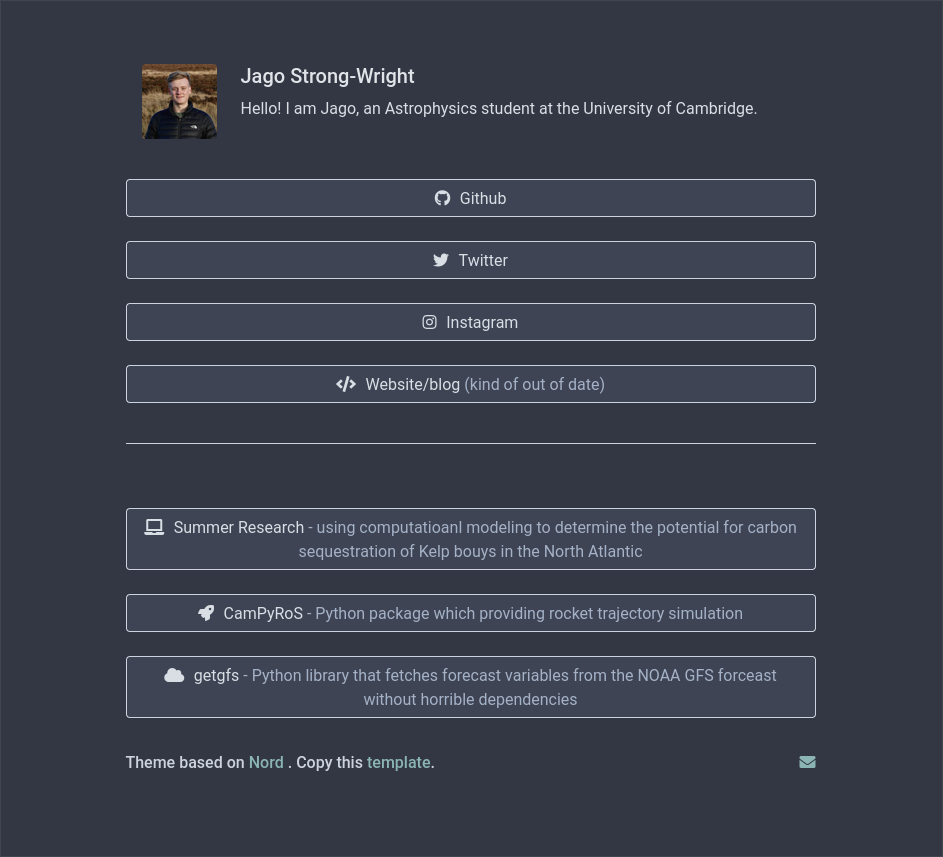

# LinkTree
This is a bootstrap one page application for sharing links or a quick homepage basef on the beautiful [Nord Theme](https://www.nordtheme.com/).

To host you can use [Guthub Pages](https://pages.github.com). See my example [here](https://jagosw.com).

## Customizing
- Change your name on lines `15` and `79`
- Add a description on lines `16` and `80`
- Add your photo on line `77` (you can just put this in the folder link locally `src="me.png"`)
- Change your email on line `105`
- Change your social links on lines `84`, `86`, `88` and `90` then drop in your interesting links from line `96`
- Setup the hit counter by changing the url in line `109` to your own (see [here](https://github.com/brentvollebregt/hit-counter))